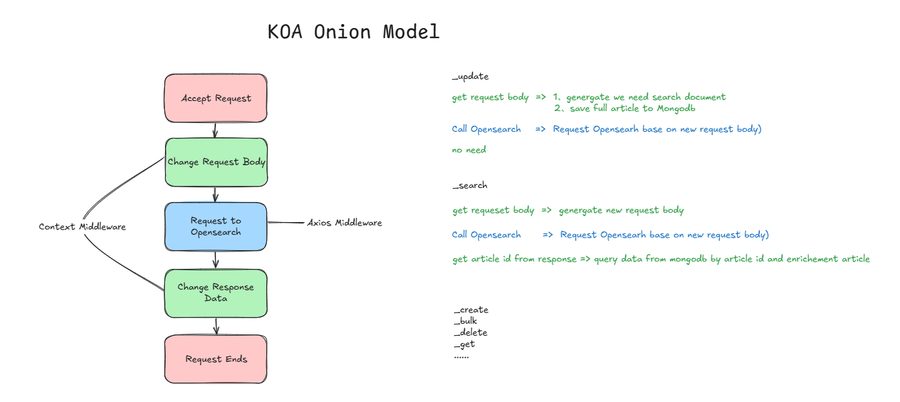

# Overview

Elasticsearch 是一个基于 Apache Lucene(TM) 的开源搜索引擎。一个请求的耗时分为两部分，Query Phase and Fetch Phase，即一个请求的时长 = Query + Fetch

## Search API

> took [Search API ](https://www.elastic.co/guide/en/elasticsearch/reference/current/search-search.html)
> (integer) Milliseconds it took Elasticsearch to execute the request.
>
> This value is calculated by measuring the time elapsed between receipt of a request on the coordinating node and the time at which the coordinating node is ready to send the response.
>
> Took time includes:
>
> - Communication time between the coordinating node and data nodes
> - Time the request spends in the search thread pool, queued for execution
> - Actual execution time
>
> Took time does not include:
>
> - Time needed to send the request to Elasticsearch
> - Time needed to serialize the JSON response
> - Time needed to send the response to a client

Query Phase 查询返回目标数据的一组 ID

Fetch Phase，计算 ID shared ~shard_num = hash(\_routing) % num_primary_shards~，根据 shard_num 去存储的 Shared 查询数据。协调节点发送请求到多个 Shard Node， 返回数据汇总后返回。

通常情况下 query 不会成为瓶颈，fetch 会成为瓶颈。将 \_source 设置为 false 时，会跳过 Fetch Phase 阶段。

## \_source

```
_source
(Optional) Indicates which source fields are returned for matching documents. These fields are returned in the hits._source property of the search response. Defaults to true. See source filtering.


true
(Boolean) The entire document source is returned.
false
(Boolean) The document source is not returned.
<string>
(string) Comma-separated list of source fields to return. Wildcard (*) patterns are supported.
```

不设置 \_source 或将 \_source 设置为 true 时，response duration 耗时 1.5-5s 左右。
将 \_source 设置为 false 时，response duratoin 在 170-400ms 左右
将 \_source 返回部分属性 `_source: ["data.context.id"] ` 效果也还行，但会经过 Fetch Phase 阶段，效率有一定影响。

## Nested 类型 [Nested Objects](https://www.elastic.co/guide/en/elasticsearch/guide/current/nested-objects.html)

```
PUT /my_index/blogpost/1
{
  "title": "Nest eggs",
  "body":  "Making your money work...",
  "tags":  [ "cash", "shares" ],
  "comments": [
    {
      "name":    "John Smith",
      "comment": "Great article",
      "age":     28,
      "stars":   4,
      "date":    "2014-09-01"
    },
    {
      "name":    "Alice White",
      "comment": "More like this please",
      "age":     31,
      "stars":   5,
      "date":    "2014-10-22"
    }
  ]
}

```

当我们提交一个文档，如果未指定 Nested 类型，会对文档做转换。

> The reason for this cross-object matching, as discussed in Arrays of Inner Objects, is that our beautifully structured JSON document is flattened into a simple key-value format in the index that looks like this:

```
{
  "title":            [ eggs, nest ],
  "body":             [ making, money, work, your ],
  "tags":             [ cash, shares ],
  "comments.name":    [ alice, john, smith, white ],
  "comments.comment": [ article, great, like, more, please, this ],
  "comments.age":     [ 28, 31 ],
  "comments.stars":   [ 4, 5 ],
  "comments.date":    [ 2014-09-01, 2014-10-22 ]
}
```

指定索引是 Nested 类型，会生成多个层级的 simple-key 对象。

> The correlation between Alice and 31, or between John and 2014-09-01, has been irretrievably lost. While fields of type object (see Multilevel Objects) are useful for storing a single object, they are useless, from a search point of view, for storing an array of objects.

> This is the problem that nested objects are designed to solve. By mapping the comments field as type nested instead of type object, each nested object is indexed as a hidden separate document, something like this:

```
{
  "comments.name":    [ john, smith ],
  "comments.comment": [ article, great ],
  "comments.age":     [ 28 ],
  "comments.stars":   [ 4 ],
  "comments.date":    [ 2014-09-01 ]
}
{
  "comments.name":    [ alice, white ],
  "comments.comment": [ like, more, please, this ],
  "comments.age":     [ 31 ],
  "comments.stars":   [ 5 ],
  "comments.date":    [ 2014-10-22 ]
}
{
  "title":            [ eggs, nest ],
  "body":             [ making, money, work, your ],
  "tags":             [ cash, shares ]
}
```

Nested 结构查询 comment 同时具备多个条件

```
{
    "bool": {
        "must": [
            {
                "nested": {
                    "query": [
                        {
                            "match": {
                                "comments.name": "alice"
                            }
                        },
                        {
                            "term": {
                                "comments.age": 31
                            }
                        }
                    ],
                    "path": "comments"
                }
            }
        ]
    }
}
```

**
ES 对仅返回 ID 类型的搜索效果很好，但返回文档或进行聚合计算 Aggregate 效果会大大打折。
应尽量减少 ES 文档的属性，全文索引会检索所有的属性。在使用时应尽量减少返回的数据属性，可以满足搜索需求就好，返回完整数据通过数据中台或其他策略完成。
**

这个程序是为了替代正在成熟 Elasticsearch 角色。这里做技术选型选择了 MongoDB，在很多语义表达上有很多相似之处。

e.g.:
es \_bulk ,mongodb bulkWrite
ES search API 中的 \_source ,mongodb find projection

仅需定义搜索业务需要的索引即可，展示需要的索引不需要定义或少量定义。主要目的就是减少 ES 索引及数据存储的大小。[Demo](index-mappings/caas-cn-zaobao-online.ts)

仅使用 ES Query Phase 部分返回一组数据的 ID，Mongo find by ids 和 projection 来约束返回数据的属性信息。



在处理 `_update/_create/_bulk`请求时，序列化 Request Body 序列化仅搜索需要的数据。原始数据存入 Mongo DB。
在处理 `_search` 请求时，请求时，\_source 会被重写为 \_source: false ，仅使用 ES 的搜索功能。而 `_source/_source_excludes/_source_includes` 会被转换成 [Mongo find projection](https://www.mongodb.com/zh-cn/docs/manual/reference/method/db.collection.find/)，结构。
在处理 `_delete` 时，也可以删除 Mongodb 数据。

但是这里支持不是很好的地方

- \_delete_by_query
- \_update_by_query
- reindex 可以使用，但我们已定义好索引 Mapping ，可能会弱化这个功能。
- \_alias 可能需要多思考一些

mongo oplog 可将数据重新洗入 Elasticsearch

参考：

[elasticsearch-fast-query-but-slow-response-time-when-retrieving-source-even-if](https://stackoverflow.com/questions/50907005/elasticsearch-fast-query-but-slow-response-time-when-retrieving-source-even-if)

[nested-objects](https://www.elastic.co/guide/en/elasticsearch/guide/current/nested-objects.html)
