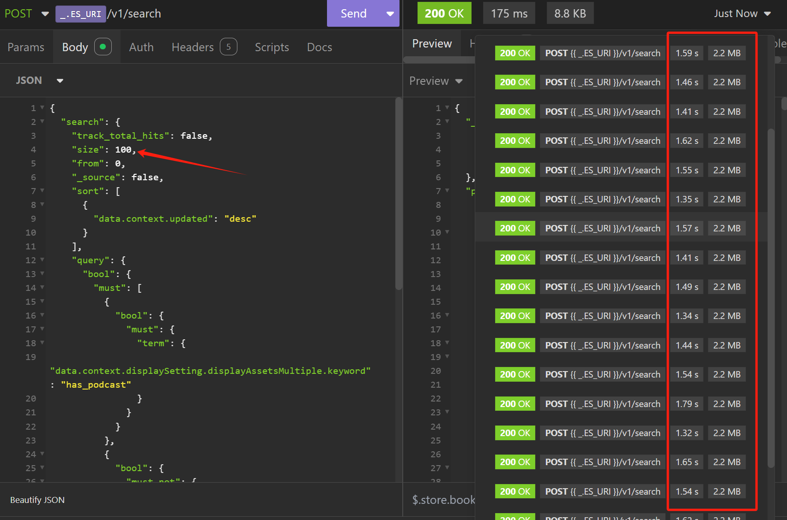
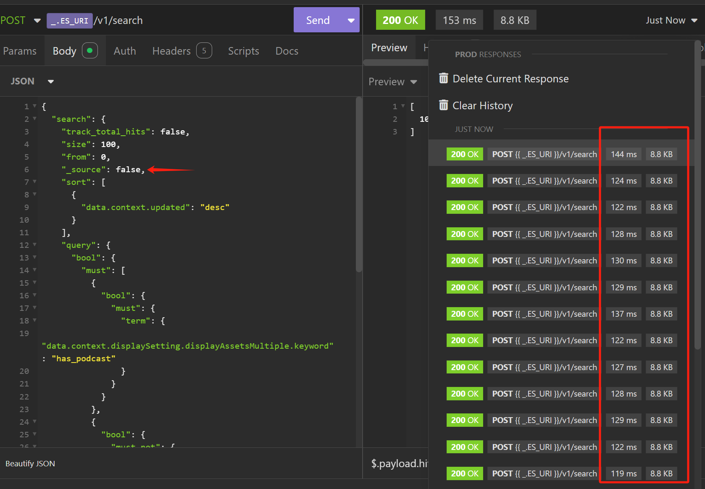

# Overview

Elasticsearch 是一个基于 Apache Lucene(TM) 的开源搜索引擎。一个请求的耗时分为两部分，Query Phase and Fetch Phase，即一个请求的时长 = Query + Fetch。通常情况下 Query Phase 不会成为瓶颈，Fetch Phase 会成为瓶颈。以下进行分析

此服务提供解决方案，Elasticsearch + Mongo 来解决搜索响应慢的问题。

# Elasticsearch

## Search API

> took [Search API ](https://www.elastic.co/guide/en/elasticsearch/reference/current/search-search.html)
>
> (integer) Milliseconds it took Elasticsearch to execute the request.
>
> This value is calculated by measuring the time elapsed between receipt of a request on the coordinating node and the time at which the coordinating node is ready to send the response.
>
> Took time includes:
>
> - Communication time between the coordinating node and data nodes
> - Time the request spends in the search thread pool, queued for execution
> - Actual execution time
>
> Took time does not include:
>
> - Time needed to send the request to Elasticsearch
> - Time needed to serialize the JSON response
> - Time needed to send the response to a client

通常一个 search 中的 took 非常小，但是总共的耗时却比较长。包含的部分，我理解这里是指 Query Phase，不包含的部分是 Fetch Phase。

## Query Phase

Query Phase 查询返回搜索结果目标的一组 ID

## Fetch Phase

Fetch Phase，协调节点计算出这一组 ID 的 shared, **shard_num = hash(\_routing) % num_primary_shards**，发送请求至数据节点获取数据，数据节点会去磁盘加载数据，序列化。把数据发送至协调节点，协调节点做排序后返回最终数据。

## Testing

**\_source** 属性测试

> \_source
> (Optional) Indicates which source fields are returned for matching documents. These fields are returned in the hits.\_source property of the search response. Defaults to true. See source filtering.
>
> true
>
> (Boolean) The entire document source is returned.
>
> false
>
> (Boolean) The document source is not returned.
>
> <string>
>
> (string) Comma-separated list of source fields to return. Wildcard (\*) patterns are supported.





不设置 \_source 或将 \_source 设置为 true 时，response duration 耗时 2 左右，偶尔 response duration 会达到 10s，受 ES 当时状态影响较大。

将 \_source 设置为 false 时，response duratoin 在 200ms 左右，时长较稳定。

将 \_source 返回部分属性 `_source: ["data.context.id"] ` 效果也还行，但会经过 Fetch Phase 阶段，效率有一定影响。

## Nested 类型 [Nested Objects](https://www.elastic.co/guide/en/elasticsearch/guide/current/nested-objects.html)

> PUT /my_index/blogpost/1

```
{
  "title": "Nest eggs",
  "body":  "Making your money work...",
  "tags":  [ "cash", "shares" ],
  "comments": [
    {
      "name":    "John Smith",
      "comment": "Great article",
      "age":     28,
      "stars":   4,
      "date":    "2014-09-01"
    },
    {
      "name":    "Alice White",
      "comment": "More like this please",
      "age":     31,
      "stars":   5,
      "date":    "2014-10-22"
    }
  ]
}
```

当我们提交一个文档，如果未指定 Nested 类型，会对文档做转换。

> The reason for this cross-object matching, as discussed in Arrays of Inner Objects, is that our beautifully structured JSON document is flattened into a simple key-value format in the index that looks like this:

```
{
  "title":            [ eggs, nest ],
  "body":             [ making, money, work, your ],
  "tags":             [ cash, shares ],
  "comments.name":    [ alice, john, smith, white ],
  "comments.comment": [ article, great, like, more, please, this ],
  "comments.age":     [ 28, 31 ],
  "comments.stars":   [ 4, 5 ],
  "comments.date":    [ 2014-09-01, 2014-10-22 ]
}
```

指定索引是 Nested 类型，会生成多个层级的 simple-key 对象。

> The correlation between Alice and 31, or between John and 2014-09-01, has been irretrievably lost. While fields of type object (see Multilevel Objects) are useful for storing a single object, they are useless, from a search point of view, for storing an array of objects.
>
> This is the problem that nested objects are designed to solve. By mapping the comments field as type nested instead of type object, each nested object is indexed as a hidden separate document, something like this:

```
{
  "comments.name":    [ john, smith ],
  "comments.comment": [ article, great ],
  "comments.age":     [ 28 ],
  "comments.stars":   [ 4 ],
  "comments.date":    [ 2014-09-01 ]
}
{
  "comments.name":    [ alice, white ],
  "comments.comment": [ like, more, please, this ],
  "comments.age":     [ 31 ],
  "comments.stars":   [ 5 ],
  "comments.date":    [ 2014-10-22 ]
}
{
  "title":            [ eggs, nest ],
  "body":             [ making, money, work, your ],
  "tags":             [ cash, shares ]
}
```

Query Nested 结构查询， comment 同时满足多个条件

```
{
    "bool": {
        "must": [
            {
                "nested": {
                    "query": [
                        {
                            "match": {
                                "comments.name": "alice"
                            }
                        },
                        {
                            "term": {
                                "comments.age": 31
                            }
                        }
                    ],
                    "path": "comments"
                }
            }
        ]
    }
}
```

**ES 对仅返回 ID 类型的搜索效果很好，且比较稳定。对返回文档或对文档进行聚合剂算 Aggregate 效果会大大打折，会随着 ES 当时的状态有较大的波动。**

**使用 ES 时应遵守的准则，应尽量减少写入文档的属性，结构不要设计的复杂，全文索引会检索所有的属性。查询结果应尽量减少返回的属性，最好是不使用 ES 内的数据，仅使用`_id`，至于返回完整数据通过数据中台或使用本服务来完成**

> - 减少 Query Phase 时的索引检索压力，`减少文档属性` & `按需使用 nested 结构`
> - 减少 Fetch Phase 的耗时，`减少返回属性` or `_source: false` 不返回数据

这个程序是为了替换掉正在成熟使用的 Elasticsearch 角色，技术选型选择了 Mongodb 两者都是文档数据库，在使用语法语义上有很多相似之处。 `_bulk => bulkWrite` `Search API _source => Mongo find projectoin`，是 Elasticsearch & Mongo 优点的结合。


# Solution

先声明**搜索业务**需要的索引，展示需要的索引**不需要定义**或少量定义。: [Index Mapping Demo](index-mappings/caas-cn-zaobao-online.ts)


## 未定义搜索 mapping

此时这个服务就是 Elasticsearch，没有任何变化。

## 定义了搜索 mapping

在处理 `_update/_create/_bulk`请求时，序列化 Request Body 序列化仅搜索需要的数据。原始数据存入 MongoDB。

在处理 `_search` 请求时，\_source 会被重写为 \_source: false。而 `_source/_source_excludes/_source_includes` 会被转换成 [Mongo find projection](https://www.mongodb.com/zh-cn/docs/manual/reference/method/db.collection.find/)结构。

> Query Phase 返回 ID List，Mongo 查询这组 ID，再遍历覆盖 \_source ，使用参数习惯不变的情况下与直接使用 ES 得到一样的结果。
>
> Query Phase 200ms + Mongo find 100ms 左右，即使是做同样查询响应时长，可以从 2-10s **缩减至 300 ms 左右**。理想状态下服务会更稳定。

在处理 `DELETE /:index/_doc/:_id` 时，也删除 Mongo 文档数据。

## TODO

- [ ] \_reindex 转存数据，应依赖 Mongo 的 oplog 重新索引 Mongo 数据承载部分
- [ ] Delete Index 需要删除 Mongo Collection
- [ ] ES Alias 更改后应如何处理

不重要的部分

- \_delete_by_query
- \_update_by_query

参考：

[elasticsearch-fast-query-but-slow-response-time-when-retrieving-source-even-if](https://stackoverflow.com/questions/50907005/elasticsearch-fast-query-but-slow-response-time-when-retrieving-source-even-if)

[nested-objects](https://www.elastic.co/guide/en/elasticsearch/guide/current/nested-objects.html)
