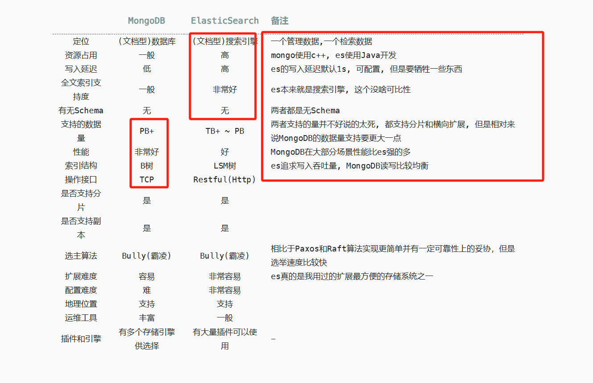

# Overview

清晰明确 Elasticsearch 存储的数据结构，通过中间件减少存储的数据大小，从而减少索引及数据压力，来提升 ES 的工作效率。
**定义好索引后，像使用 ES 一样去使用此服务。**

## 关心 ES 使用姿势：

- 仅满足搜索条件的数据结构
- 除搜索需求之外，报表属性
- 除搜索需求之外，报表属性，业务展示需求的属性
- 原始数据结构

## 示例 Data

```
{
  "title": "Nest eggs",
  "body":  "Making your money work...",
  "tags":  [ "cash", "shares" ],
  "comments": [
    {
      "name":    "John Smith",
      "comment": "Great article",
      "age":     28,
      "stars":   4,
      "date":    "2014-09-01"
    },
    {
      "name":    "Alice White",
      "comment": "More like this please",
      "age":     31,
      "stars":   5,
      "date":    "2014-10-22"
    }
  ]
}
```

如上，我们有一个原始文档。搜索需求需要根据 `title`、`tags` 和 `comments` 中的 `age`、`stars` 做检索。

- 在上报数据之前，修改 body 与搜索姿势匹配，(OK 转身离开，下面不用看了)
- 使用此服务，确定使用姿势，定义如下 Index mapping，替代 Elasticsearch

```
const blogPostIndexMapping: T.IndicesPutMappingRequest =
  {
    index: 'my_index',
    properties: {
      title: {type: 'text'},
      // body: {type: 'text'},
      tags: {type: 'keyword'},
      comments: {
        type: 'nested',
        properties: {
          // name: {type: 'keyword'},
          age: {type: 'integer'},
          stars: {type: 'integer'},
          // date: {type: 'date'},
        }
      }
      // address: {type: 'keyword'},
    }
}

```

把 `blogPostIndexMapping` 装载入系统：

```
const indexMappingList = [mapping, blogPostIndexMapping]
```

[Index Mapping Demo](index-mappings/blog-post.ts)

发起 document 插入或更新请求。

```curl --request POST \
  --url http://127.0.0.1:3001/my_index/_update/1 \
  --header 'Authorization: ApiKey <ES API KEY>' \
  --header 'Content-Type: application/json' \
  --header 'User-Agent: insomnia/9.3.2' \
  --data '{
	"doc_as_upsert": true,
	"doc": {
		"title": "Nest eggs",
		"body": "Making your money work...",
		"tags": [
			"cash",
			"shares"
		],
		"comments": [
			{
				"name": "John Smith",
				"comment": "Great article",
				"age": 28,
				"stars": 4,
				"date": "2014-09-01"
			},
			{
				"name": "Alice White",
				"comment": "More like this please",
				"age": 31,
				"stars": 5,
				"date": "2014-10-22"
			}
		]
	}
}'
```

```
{
  "url": "https://0fe4e0624dd34ab8af08a893c97e8f3e.us-central1.gcp.cloud.es.io:443/my_index/_update/1",
  "method": "POST",
  "headers": {
    "content-type": "application/json",
    "user-agent": "insomnia/9.3.2",
    "authorization": "ApiKey <ES API KEY>",
    "accept": "*/*",
    "host": "0fe4e0624dd34ab8af08a893c97e8f3e.us-central1.gcp.cloud.es.io"
  },
  "params": {},
  "data": "{\"doc\":{\"title\":\"Nest eggs\",\"tags\":[\"cash\",\"shares\"],\"comments\":[{\"age\":28,\"stars\":4},{\"age\":31,\"stars\":5}]},\"doc_as_upsert\":true}"
}
```

可以看到 data 内的数据结构即是定义的索引结构，确保不会因为提交数据的更多而引起 ES Index Mapping 的变更。

将更多的注意力放在，业务上。

<details>
<summary>启用 Mongo 作为数据载体</summary>

## 启用 Mongo 作为数据载体（Option）



把 ES 仅做为搜索引擎使用，Mongo 作为数据数据载体时。`_search` 代理到 ES 时 `_source` 为 false，此时 ES 会跳过 Fetch Phase，搜索效率会大大提高。ES response 的 ID List 会去 Mongo 中查询，并做数据富华，最终返回结果和直接使用 ES 一样。

启用 Mongo 后，可能面临的问题是费用的提升，但搜索服务会更稳定。

> 修改文档时，缩减数据结构存入 ES，同时存储原始数据到 Mongo。index name 就是 Mongo 的 collection
>
> 搜索时 ES Query Phase 返回 ID List，response 中的\_source 从 Mongo 还原

### `.env` 启用 Mongo 配置

```

MONGO_ENABLE=TRUE
MONGODB_URL=mongodb://root:<PASSWORD>@dds-2vc5c94f551f46941635-pub.mongodb.cn-chengdu.rds.aliyuncs.com:3717/admin?replicaSet=mgset-1150466874&directConnection=true
MONGODB_DBNAME=<dev>

```

</details>


- [x] 支持 Aggregate
- [x] `<index>/_bulk`
- [x] `<index>/_create`
- [x] `<index>/_delete `
- [x] `<index>/_get `
- [x] `<index>/_search `
- [x] `<index>/_update `
- [ ] `_reindex`，如果需要考虑从 Mongo Oplog 到 ES，避免原始数据丢失
- [ ] Delete Index 需要 Delete Mongo Collection
- [ ] `_alias` 需要考虑
- [ ] `_msearch`

不重要部分

- `_delete_by_query`
- `_update_by_query`

不支持

- 多个 index 搜索 `/<index1,index2,*>/_search`


### Q/A

<details>
<summary>Q: 如上报数据的索引未被定义会发生什么？</summary>
此时此服务就是 ES，直接转发任何请求至 ES。
</details>

<details>
<summary>Q: 认证 API-KEY 是怎么处理的？</summary>
API-KEY 是后端的 ES 的 API-KEY，权限认证、状态码等都是 ES 的真实响应
</details>

<details>
<summary>Q: 启用 Mongo 后 搜索语句中的 `_source/_source_excludes/_source_includes` 是如何处理的？</summary>

```
Phase 01 查询 ES 时，`_source` 是 false。跳过 Fetch Phase
Phase 02 查询`_source` 被转换成 [Mongo find projection](https://www.mongodb.com/zh-cn/docs/manual/reference/method/db.collection.find/)，此时 Mongo 返回的数据结构与 ES 的`_source` 同等效果。

```

</details>

<details>
<summary>Q:响应速度可能被优化到多少？</summary>

从做的一些实验上来看 150ms(Query Phase) + 2s(Fetch Phase) + ?ms(Mongo ) = 总耗时。
如果 Mongo 稳定在 200 ms 左右，那搜索可被稳定在 350 ms 左右。

</details>
