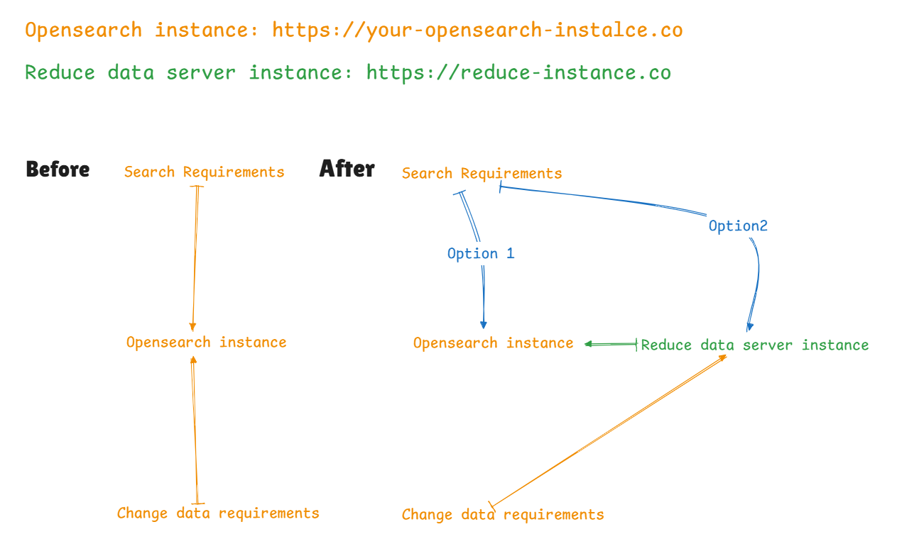
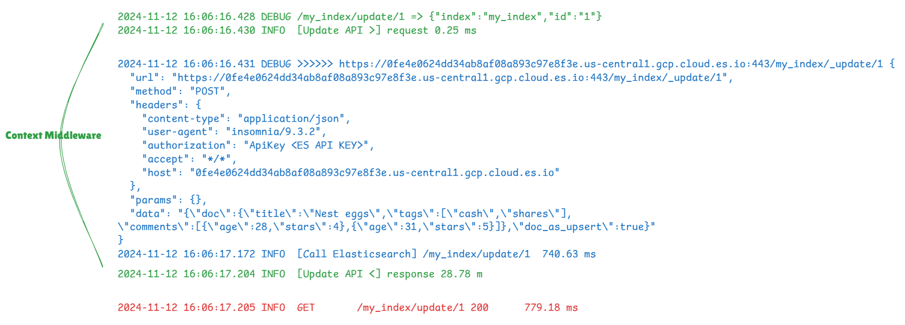

# Overview

通过此程序减少发送到 ES 的数据量，之前的任何使用方式都不需要做更改。
通过优化数据量，来优化响应速度和减少成本



# ES 使用姿势：

- 仅满足搜索条件的数据结构
- 除搜索需求之外，报表属性
- 除搜索需求之外，报表属性，业务展示需求的属性
- 原始数据结构

# Key Feature

## 定义数据 Mapping

[Index Mapping Demo](index-mappings/blog-post.ts)
定义好 Es 索引结构，上报的数据只会是定义的数据结构。

> 服务使用 NodeJs Koa 框架开发，使用 Middleware 来拦截修改请求数据，在 Request 和 Response 中修改数据逻辑，请求路径和返回值都是 Elasticsearch 的数据。

## 装载索引

[Index](index-mappings/index.ts)

```
const indexMappingList = [mapping, blogPostIndexMapping]
```

> 完成以上步骤，像使用 ES 一样去使用此服务。

# Example

```
{
  "title": "Nest eggs",
  "body":  "Making your money work...",
  "tags":  [ "cash", "shares" ],
  "comments": [
    {
      "name":    "John Smith",
      "comment": "Great article",
      "age":     28,
      "stars":   4,
      "date":    "2014-09-01"
    },
    {
      "name":    "Alice White",
      "comment": "More like this please",
      "age":     31,
      "stars":   5,
      "date":    "2014-10-22"
    }
  ]
}
```

如上，我们有一个原始文档。搜索需求需要根据 `title`、`tags` 和 `comments` 中的 `age`、`stars` 做检索。

## 定义索引

```
const blogPostIndexMapping: T.IndicesPutMappingRequest =
  {
    index: 'my_index',
    properties: {
      title: {type: 'text'},
      // body: {type: 'text'},
      tags: {type: 'keyword'},
      comments: {
        type: 'nested',
        properties: {
          // name: {type: 'keyword'},
          age: {type: 'integer'},
          stars: {type: 'integer'},
          // date: {type: 'date'},
        }
      }
      // address: {type: 'keyword'},
    }
}

```

## 装载索引

## 发起请求

发起 document 插入或更新请求。

```curl --request POST \
  --url http://127.0.0.1:3001/my_index/_update/1 \
  --header 'Authorization: ApiKey <ES API KEY>' \
  --header 'Content-Type: application/json' \
  --header 'User-Agent: insomnia/9.3.2' \
  --data '{
	"doc_as_upsert": true,
	"doc": {
		"title": "Nest eggs",
		"body": "Making your money work...",
		"tags": [
			"cash",
			"shares"
		],
		"comments": [
			{
				"name": "John Smith",
				"comment": "Great article",
				"age": 28,
				"stars": 4,
				"date": "2014-09-01"
			},
			{
				"name": "Alice White",
				"comment": "More like this please",
				"age": 31,
				"stars": 5,
				"date": "2014-10-22"
			}
		]
	}
}'
```

### log



### 实际上报的 Body

```
{
  "doc": {
    "title": "Nest eggs",
    "tags": [
      "cash",
      "shares"
    ],
    "comments": [
      {
        "age": 28,
        "stars": 4
      },
      {
        "age": 31,
        "stars": 5
      }
    ]
  },
  "doc_as_upsert": true
}

```

可以看到上报的数据，就是索引定义的数据结构。

将更多的注意力放在业务上。

### 在以下方法减少数据 body

#### [Index API/Create API](https://www.elastic.co/guide/en/elasticsearch/reference/current/docs-index_.html)

- PUT /:index/\_doc/:\_id
- POST /:index/\_doc/
- PUT /:index/\_create/:\_id
- POST /:index/\_create/:\_id

#### [Update API](https://www.elastic.co/guide/en/elasticsearch/reference/current/docs-update.html)

- POST /:index/\_update{/:\_id}

#### [Bulk API](https://www.elastic.co/guide/en/elasticsearch/reference/current/docs-bulk.html)

- POST /\_bulk
- POST /:target/\_bulk

[Elasticsearch Distributed Search](https://github.com/wyl/es-libr/blob/main/elasticsearch%20distributed%20search.md)

### Q/A

<details>
<summary>Q: 定义过索引的数据提交会更改提交的数据结构，未定义索引的数据会怎样处理？</summary>
未定义会直接转发原始Body，此时这个服务本身就是ES
</details>

<details>
<summary>Q: 认证是怎样处理的？</summary>
认证未做任何更改，认证及返回的状态都是ES 本身的真实相应
</details>

<details>
<summary>Q:响应速度可能被优化到多少？</summary>
是通过优化提交ES 的数据结构，减少上报的数据结构来优化时长。响应速度可能被优化的不多，优化的是ES 的使用成本。

</details>
